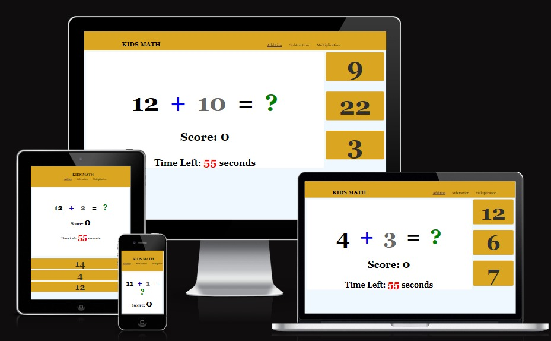
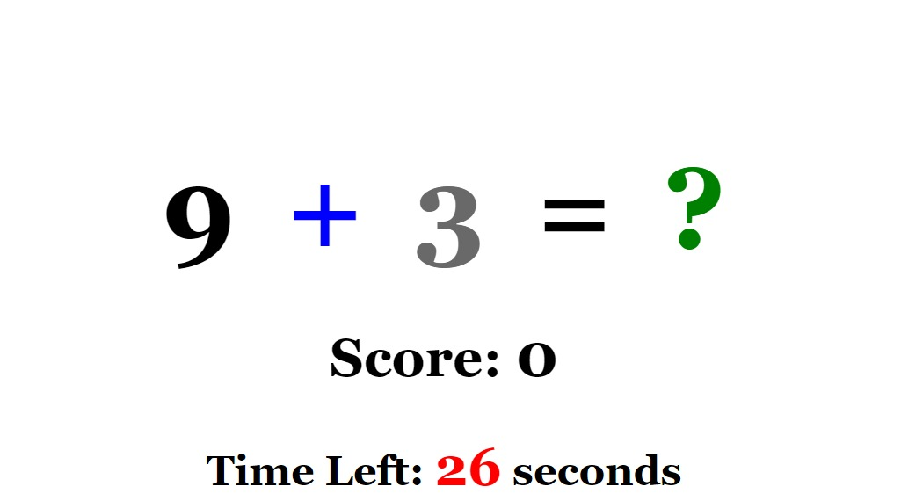
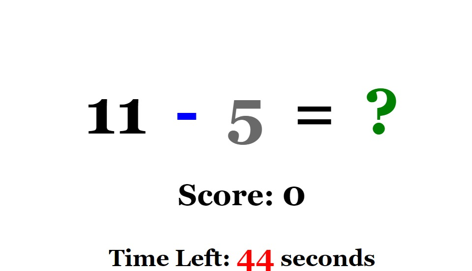
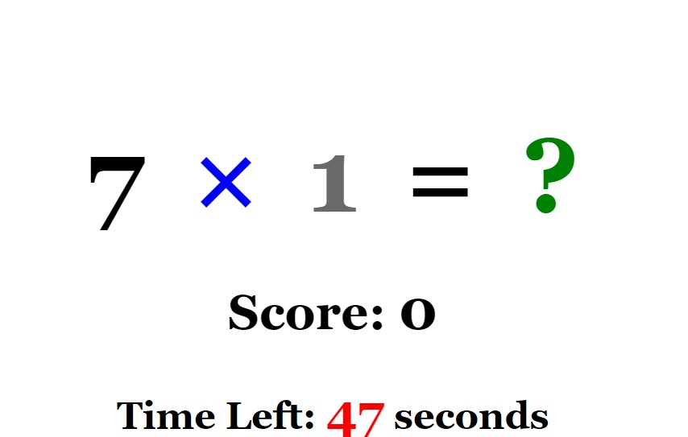
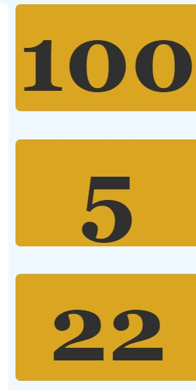
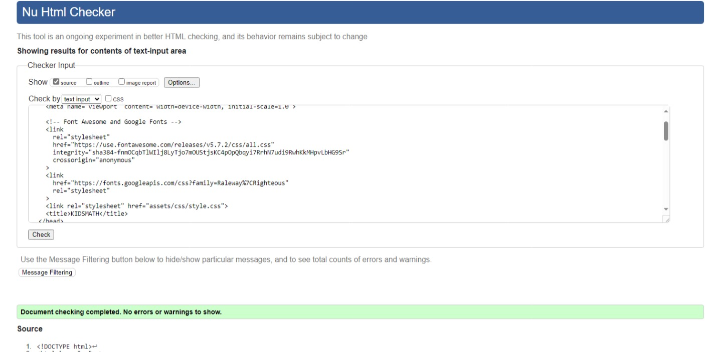
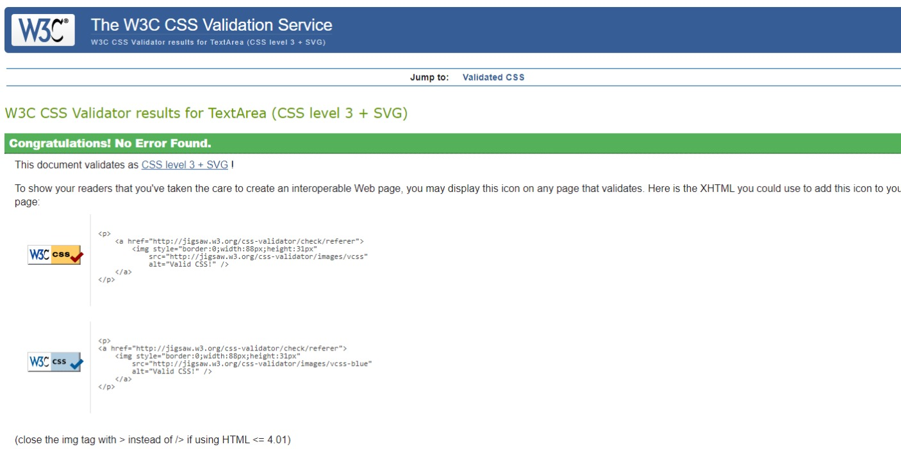
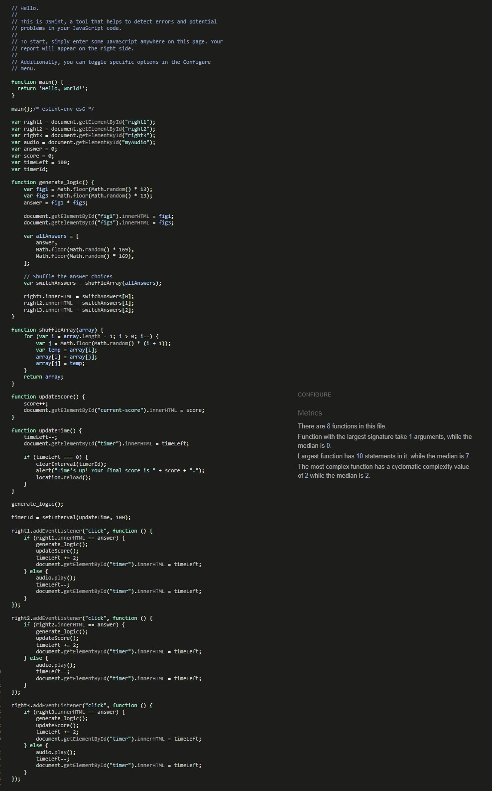

# KIDSMATH: Math Problem-Solving Prodigy

## Problem-Solving Skills

KidsMath helps children develop critical thinking and problem-solving skills. They learn to analyse situations, identify patterns, and find solutions.

### Target Audience

Math for kids include preschoolers to high school students, parents, teachers, homeschoolers, online learners, and adults seeking math skills. Tailoring content to their specific needs and interests is essential.

### Logical Reasoning

 Math encourages logical reasoning and deductive thinking, which are valuable skills in various aspects of life, including decision-making and planning.

### Existing Features

- __Navigation Bar__

- Present on all three pages, the fully responsive navigation bar consists of Addition, Subtraction, and Multiplication. It maintains uniformity across all pages for effortless navigation.
  - This feature enables seamless navigation across all devices, allowing users to move between pages without needing to use the 'back' button.

- __Addition__

  - The Addition section is designed to help kids practice basic math by adding one-digit numbers together. It offers a simple and engaging way for children to enhance their addition skills while timing themselves and tracking their scores.

- __Subtraction__

- In the subtraction section, children can sharpen their subtraction skills by subtracting single-digit numbers. This interactive module provides a fun and educational way for kids to measure their performance, track their scores, and improve their math abilities

- __Multiplication__

- In the multiplication section, youngsters can enhance their multiplication proficiency by multiplying single-digit numbers. This interactive feature offers an engaging and instructive experience, enabling kids to time their progress, monitor their scores, and enhance their mathematical skills.

- __Answer Choice__
  

- Answer choices enable children to make selections, helping them pick the right option. An incorrect choice triggers a sound effect, providing feedback in a fun and engaging way.

## Technologies Used

__Github__ - Used for storage of my site and for publishing online.\
__Codeanywhere__ - The IDE used for editing my site and pushing changes.\
__HTML5__ - The core of the site was built with HTML version 5.\
__CSS__ - CSS was used to style the website and define fonts and layout.\
__JavaScript__-The logic behind adding, subtract, and multiply.\

### Validator Testing

- HTML
- Pass

- No errors were returned when passing through the official [W3C validator](validator.w3.org/nu/?dwere found when passing through the official              [(W3C validator)](https://validator.w3.org/nu/#textarea)
  

- HTML
-Pass

- No errors were returned when passing through the official [W3C validator](validator.w3.org/nu/?dwere found when passing through the official              [(W3C validator)](https://validator.w3.org/nu/#textarea)
  
- HTML
-Pass

- No errors were returned when passing through the official [W3C validator](validator.w3.org/nu/?dwere found when passing through the official              [(W3C validator)](https://validator.w3.org/nu/#textarea)

-CSS

 - Pass

- No errors were returned when passing through the official [W3C validator](validator.w3.org/nu/?dwere found when passing through the official [(Jigsaw) validator](https://jigsaw.w3.org/css-validator/validator)

 - Pass

- No warnings were returned when passing through the official validating  [(Jshint) validator](https://jshint.com/)

 - Pass

- No warnings were returned when passing through the official validating [(Jshint) validator](https://jshint.com/)
 - Pass

- No warnings were returned when passing through the official validating  [(Jshint) validator](https://jshint.com/)

## Deployment

I deployed my websites which includes all pages. The site was deployed to GitHub pages.

- The steps to deploy are as follows:
  - In the GitHub repository, navigate to the Settings tab
  - From the source section drop-down menu, select the Master Branch
  - Once the master branch has been selected, the page will be automatically refreshed with a detailed ribbon display to indicate the successful deployment.

The live link can be found here - <https://samakinbile.github.io/KIDS-MATH/>

## Credits

### Content
- The idea of this project was brought from Project 1, KidBike[Project 1](https://samakinbile.github.io/KidBik/)
- Instructions on the structure how to implement this project was taking from a youtube [Specific YouTube Tutorial](https://www.youtube.com/@codefoxx)
- Some intructions and coding are also followed from openai and internet  [Openai](https://openai.com/)

### Media

- The sounds effect was taking from internet.